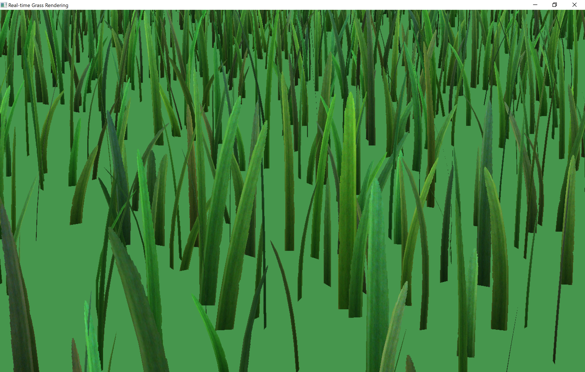
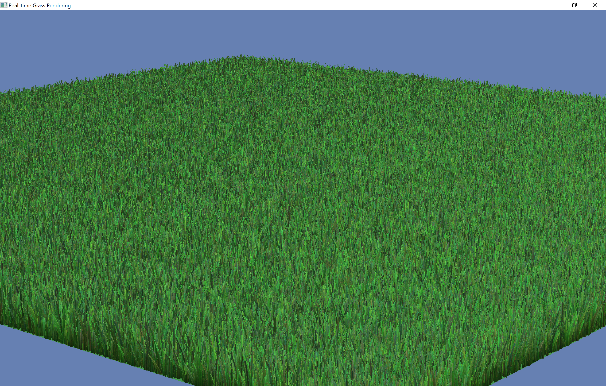
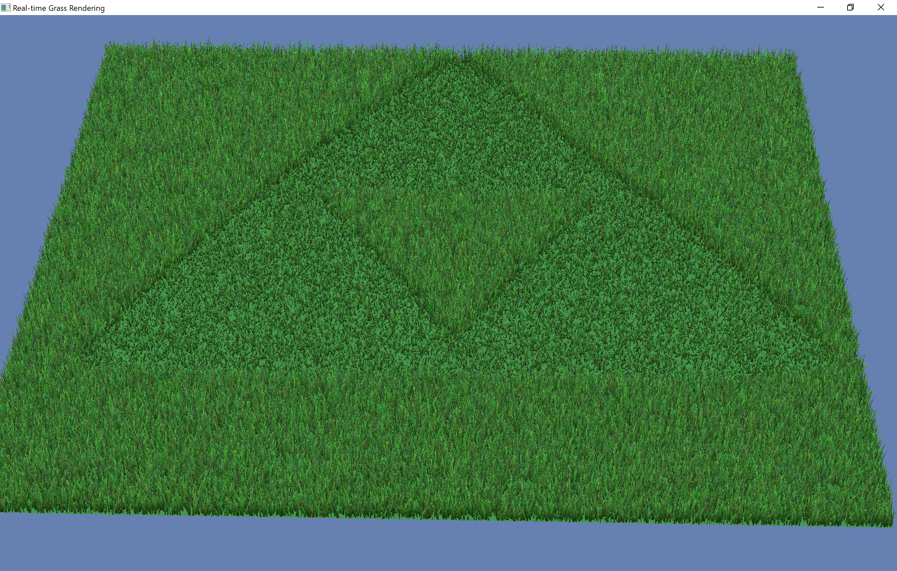

# Real-time Geometry-based Grass Rendering

An implementation of [this paper](https://www.cg.tuwien.ac.at/research/publications/2013/JAHRMANN-2013-IGR/).

## Sample Images

First are a couple images of the basic view with different blade counts.

Next are some examples of the "force map" concept. The ideas is that the vertex shader reads pixels from a texture as vector forces that act on the current blade of grass.

Finally, some animated GIFs to show off the wind simulation and some of the interactive features. These were captured on a laptop without a dedicated graphics card, so small numbers of blades were used so that the GIF would be smoother.

## Features

Nearly everything described in the paper has been implemented, the notable exceptions being the special textures (like density map and vegetation map) and the hierarchical structure for visibility testing.

The following was implemented:
- A configurable number of gras blades are generated once and instancing is used to draw the grass patch multiple times to form a larger field
- The scene is fully interactive, the user can pan the camera (left click and drag), zoom in or out (right click and drag vertically), and rotate the grass field (right click and drag horizontally)
- There is a basic function that simulates wind which can be turned on or off by pressing the spacebar
- The tessellation level of grass blades correspond to how close to the camera they are, blades beyond a fixed max distance are culled
- Each blade is shaped by masking with a texture, and every individual blade has random variance in the rotation about its centre, amount of bending, width, height, and colour.
- Each blade calculates its own lighting
- "Force map" textures can be used to arbitrarily deform the grass field
